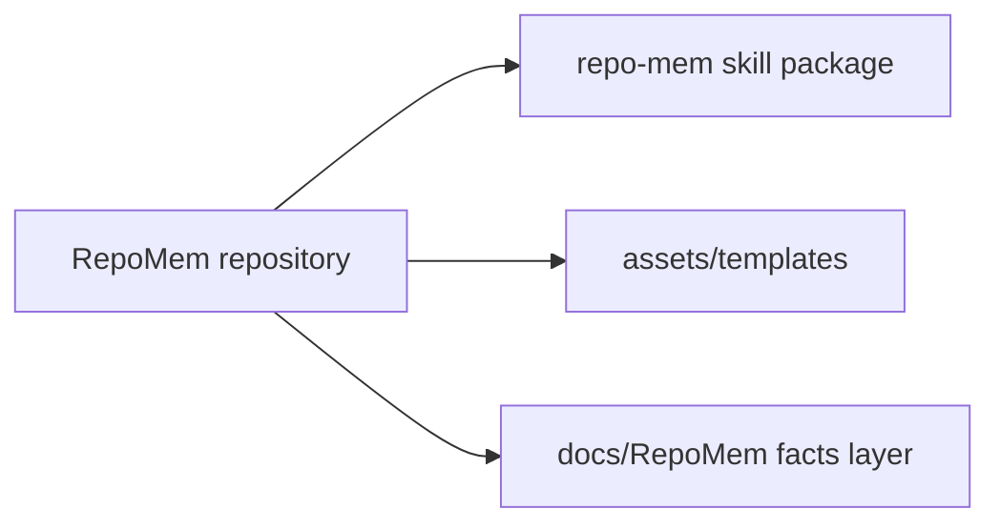

# 架构索引

## Purpose

这份文档是当前 `RepoMem` 子仓库的全局架构导航层。
它只保留整体结构、domain 导航和跨域关系，不承载所有细节。

## System Overview

- 该仓库的目标是把 `repo-mem` 作为可独立发布的 skill 包和独立 GitHub 仓库持续演进。
- 当前仓库内部同时包含三类关键内容：
  - `repo-mem/` 下的 skill 包
  - `repo-mem/assets/templates/` 下的标准模板源
  - `docs/RepoMem/` 下的 RepoMem 自举长期事实与临时文档
- `docs/RepoMem/` 现在是 RepoMem 子仓库自己的标准长期事实层。

## Architecture Diagram

## Domain Map

| Domain | Purpose | Related Code Paths | Doc |
| --- | --- | --- | --- |
| repo-mem | 记录 RepoMem 作为 skill 包、模板源和自举实例时的结构、边界和规则 | `repo-mem/`, `docs/RepoMem/` | [repo-mem](./repo-mem.md) |

## Cross-Domain Relationships

- `repo-mem/` 定义通用 skill 规则、references、scripts 和模板。
- `docs/RepoMem/` 是当前 RepoMem 子仓库的长期事实源和临时工作区。
- skill 包、模板源和运行态文档必须保持语义隔离，避免 runtime 事实自动污染 skill 规则。

## Read Order

- 先读本文件，再读 [repo-mem](./repo-mem.md)。
- 如果要理解当前迁移状态，再读 `../memory/repo-mem.md`。

## Split Policy

- 全局结构、主要关系和迁移边界保留在这里。
- `repo-mem` 的具体结构事实下沉到对应 domain 文档。
